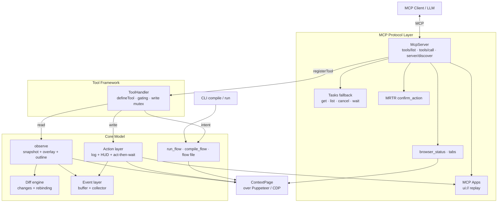
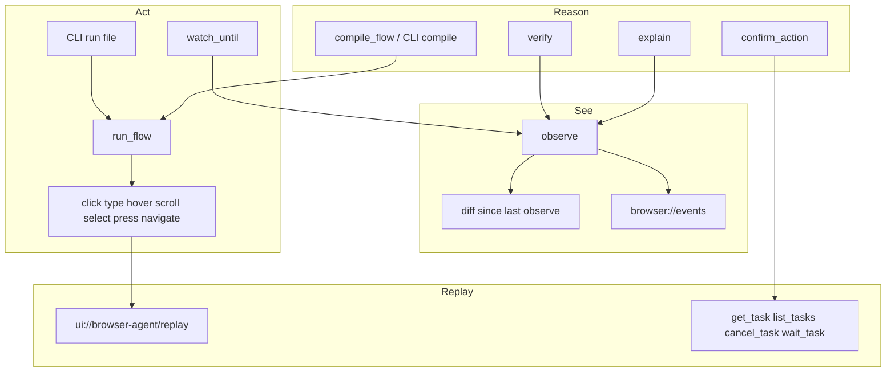

<p align="center">
  
</p>

<p align="center">
  A unified, event-driven, visually-rich <strong>MCP browser engine</strong> on Puppeteer.
  An agent authors a path by visible name. CI replays the saved JSON with no model.
</p>

<p align="center">
  <a href="https://github.com/PremierStudio/BrowserAgent/blob/master/LICENSE"></a>
  <a href="https://github.com/PremierStudio/BrowserAgent/actions"></a>
  <a href="https://github.com/PremierStudio/BrowserAgent"></a>
  <a href="https://github.com/PremierStudio/BrowserAgent"></a>
  <a href="https://github.com/PremierStudio/BrowserAgent"></a>
  <a href="https://pptr.dev"></a>
  <a href="https://modelcontextprotocol.io"></a>
  <a href="https://nodejs.org"></a>
  <a href="https://github.com/PremierStudio/BrowserAgent/graphs/contributors"></a>
</p>

<p align="center">
  <a href="#thesis">Thesis</a> · <a href="#why">Why</a> · <a href="#architecture">Architecture</a> · <a href="#getting-started">Getting Started</a> · <a href="#saved-flows">Saved flows</a> · <a href="#engineering">Engineering</a> · <a href="#roadmap">Product</a>
</p>

---

## Highlights

- **One model, not two.** `observe` returns the a11y snapshot and the pixel overlay in a single call.
- **Names, not CSS.** `run_flow` binds `name` / `role` / `near`, re-resolves after click or navigate, and stops with candidates when a label is ambiguous.
- **Author once, replay with no AI.** A durable JSON flow has no uids. `compile` checks it. `run` plays it. CI spends zero tokens.
- **Headed by default.** Left-snap Chrome, live cursor HUD, paced typing. Headless is instant.
- **Diffs, not dumps.** The diff engine returns what changed, with fingerprint-based uid rebinding.
- **Events, not polling.** Console, network, DOM, navigation, and resize are collected and pushed.
- **Strict TDD at 100/100.** Coverage and mutation are CI gates. TypeScript only.

This repo is the **browser engine**. It is not PremierQuality (catalogs, people, release gates) and not BugTrace (video recordings).

---

<a id="thesis"></a>

## The thesis

Most browser integrations split "read the page" from "act on the page." One world is text, the other is pixels. The model re-reads every turn and guesses which box is which control.

BrowserAgent builds one object: the semantic layer and the visual layer together. The model can watch, act, and explain. After a path is compiled into named steps, the engine can replay it without a model.

---

<a id="why"></a>

## Why another browser MCP server?

It is not a fork of `chrome-devtools-mcp`. It borrows proven patterns (stable uids keyed by `loaderId_backendNodeId`, a `ContextPage` over Puppeteer, act-then-wait, token-optimized formatters) and rebuilds them around a different shape:

- **Unified observe.** One call returns the a11y tree with the pixel overlay.
- **Named intent.** `run_flow` is one call for a sequence, not observe-per-page.
- **Durable files.** Saved JSON is names plus expects. Uids die on the next navigation.
- **Fewer round trips.** The browser and the LLM are the bottlenecks.

---

<a id="architecture"></a>

## Architecture



The protocol layer is a thin MCP bridge. `ToolHandler` gates tools. `ContextPage` hides Puppeteer. Nothing in intent or protocol talks to a raw Page.

| #   | Piece                                                                      | Milestone |
| --- | -------------------------------------------------------------------------- | --------- |
| 1   | **`observe`**: a11y snapshot, screenshot, overlay, outline                 | **M1**    |
| 2   | **Diff engine**: changes since last observe, fingerprint rebind            | **M2**    |
| 3   | **Events**: console, network, DOM, navigation, resize                      | **M4**    |
| 4   | **Action log + HUD**: click, type, hover, scroll, select, press, navigate  | **M3**    |
| 5   | **MCP**: stdio and Streamable HTTP, `server/discover`, annotations         | **M5**    |
| 6   | **Desk**: `browser_status`, open/close/reap, tabs                          | **M5+**   |
| 7   | **Intent**: `watch_until`, `compile_flow`, `run_flow`, `verify`, `explain` | **M6**    |
| 8   | **Saved flows**: versioned JSON, `compile` / `run` with no MCP             | **M6+**   |
| 9   | **MCP Apps replay**: `ui://browser-agent/replay`                           | **M7**    |

---

<a id="getting-started"></a>

## Getting started

### Requirements

| Tool       | Version                                                           |
| ---------- | ----------------------------------------------------------------- |
| Node.js    | `>= 20.19`                                                        |
| npm        | bundled with Node                                                 |
| TypeScript | `^6.0.3` (TS 6, not the 7.x Go port; see `docs/decisions.md` #16) |

### Install

```bash
git clone https://github.com/PremierStudio/BrowserAgent.git
cd BrowserAgent
npm install
npm run build
```

### Run the MCP server

`npm start` launches Chrome, attaches events, and serves MCP over stdio. The window is visible by default: one tab, snapped to the left half of the primary work area. If you move or resize it, the server notices (`resize` events plus `pageState.layout` / `pageState.resized` on observe), drops a locked viewport, and keeps the new size. It does not snap the window back.

```bash
npm start
```

```bash
# Force a visible window
node dist/cli.js --headed

# Headless (CI / background)
# PowerShell: $env:BROWSER_AGENT_HEADED='0'
BROWSER_AGENT_HEADED=0 npm start
```

Streamable HTTP (same tool set) on port 3333, or `PORT`:

```bash
npm start -- --http
```

Point an MCP client at `node dist/cli.js`. The server exposes `tools/list`, `tools/call`, and `server/discover`.

### Chrome desk

These tools do not need a page tool first. `browser_status` lists this MCP Chrome, peers, orphans, and closed instances. It does not launch Chrome.

| Tool                 | Job                                          |
| -------------------- | -------------------------------------------- |
| `browser_status`     | List this instance, peers, orphans, closed   |
| `browser_open`       | Open this MCP Chrome. Safe when already open |
| `browser_close`      | Close this Chrome and mark it closed         |
| `browser_reap`       | Kill leftover Chrome whose MCP agent is gone |
| `browser_new_tab`    | Open a tab. Optional `url`                   |
| `browser_switch_tab` | Switch to a tab id from `browser_status`     |
| `browser_close_tab`  | Close a tab. Refuses to close the last tab   |

### Page tools

`observe`, `click`, `type`, `hover`, `scroll`, `select`, `press`, `navigate`

`observe` with `detail=outline` is the compact label list used to plan a flow. `detail=full` includes a screenshot.

### Intent tools

`watch_until`, `compile_flow`, `run_flow`, `verify`, `explain`

Prefer **one `run_flow`** with `name` / `role` / `near` instead of observe-per-page. The server re-observes after click or navigate. A name must bind uniquely or the flow stops with candidates, before any hover or click. Use `near` when labels repeat (demo credentials vs the real Username field). Put `expectUrl` / `expectText` on steps that change the page. Headed mode polls until they match. `action: check` only asserts.

`compile_flow` is read-only. It binds the current-page prefix and leaves later pages as names. It does not act.

### How it looks

A visible window is paced like a person: live cursor HUD, about 28ms per typed character, about 700ms between `run_flow` steps. Config only overrides that.

| Variable                  | Role                                            |
| ------------------------- | ----------------------------------------------- |
| `BROWSER_AGENT_HEADED=0`  | Headless and instant                            |
| `BROWSER_AGENT_PACE_MS`   | Pause between `run_flow` steps (`0` is instant) |
| `BROWSER_AGENT_TYPE_MS`   | Pause between typed characters (`0` is instant) |
| `BROWSER_AGENT_EXPECT_MS` | How long headed mode waits for `expect*`        |
| `BROWSER_AGENT_WORK_AREA` | `x,y,width,height` if the default snap is wrong |

### Other MCP surface

**Tasks fallback** (decision #2, hosts without `ext-tasks`): `get_task`, `list_tasks`, `cancel_task`, `wait_task`

**HITL:** `confirm_action` returns an `InputRequiredResult` (MRTR / elicitation)

**Resources:** `browser://events` (JSON event stream) and `ui://browser-agent/replay` (MCP App HTML replay)

**Trace:** `list_calls` lists recent tool calls with `durationMs` and `resultBytes`

---

<a id="saved-flows"></a>

## Saved flows (no MCP, no model)

A durable flow is versioned JSON. No uids on disk. Click and navigate must have `expectUrl` or `expectText`. Type, hover, scroll, select, and press do not.

```json
{
  "version": 1,
  "name": "login",
  "origin": "https://example.com",
  "steps": [
    {
      "action": "navigate",
      "url": "https://example.com/login",
      "expectText": "Username"
    },
    { "action": "type", "name": "Username", "text": "tomsmith" },
    {
      "action": "click",
      "name": "Login",
      "role": "button",
      "expectText": "Logout"
    }
  ]
}
```

`compile` checks the file without opening Chrome. `run` launches Chrome (or uses the headed/headless flags) and plays the steps. A failure names the step: `step 2 click: no target ...`.

```bash
npm run build
node dist/cli.js compile tests/fixtures/login.flow.json
```

```powershell
# PowerShell, headless replay
$env:BROWSER_AGENT_HEADED='0'
node dist/cli.js run tests/fixtures/login.flow.json
```

The authoring loop is: MCP `run_flow` until binds are unique, write the JSON (no uids), `compile`, then `run` in CI. There is no `save_flow` MCP tool. That would blow the 8KiB `tools/list` line budget.

### Headed demos

These stay on public, well-labeled pages. No CAPTCHA, no account signup. They resolve every control by `name` / `near`.

**Showcase** (`SHOWCASE_STEPS`): httpbin pizza form, the-internet login, Add/Remove, forgot password, Sauce Demo cart checkout, Playwright TodoMVC.

```powershell
$env:BROWSER_AGENT_SHOWCASE='1'
npx vitest run tests/integration/chrome.showcase.test.ts
```

**Banking** (`BANKING_STEPS`): XYZ Bank customer login, Harry Potter, deposit 150, stop on Deposit Successful.

```powershell
$env:BROWSER_AGENT_INTEGRATION='1'
npx vitest run tests/integration/chrome.banking.test.ts
```

A saved-flow Chrome proof lives in `tests/integration/chrome.flowFile.test.ts` (local HTML, no public network).

---

### Run the full gate chain

This is exactly what CI enforces:

```bash
npm run ci
```

### Individual gates

| Command                    | What it does                                              |
| -------------------------- | --------------------------------------------------------- |
| `npm run typecheck`        | `tsc --noEmit`                                            |
| `npm run lint`             | ESLint (bans `as`/`any`/`!`/`@ts-ignore`/`.forEach`)      |
| `npm run format`           | Prettier check                                            |
| `npm run knip`             | dead code / unused deps (zero findings)                   |
| `npm test`                 | Vitest                                                    |
| `npm run test:integration` | Real Chrome (set `BROWSER_AGENT_INTEGRATION=1`)           |
| `npm run showcase`         | Long headed public-site demo (`BROWSER_AGENT_SHOWCASE=1`) |
| `npm run coverage`         | 100% threshold (lines/branches/functions/statements)      |
| `npm run mutation`         | Stryker, 100% threshold + survivor registry               |
| `npm run reports`          | coverage + JUnit XML into `reports/`                      |

### Software stack

| Layer     | Package                                                                                      | Version                    |
| --------- | -------------------------------------------------------------------------------------------- | -------------------------- |
| Protocol  | [`@modelcontextprotocol/server`](https://www.npmjs.com/package/@modelcontextprotocol/server) | `^2.0.0` (2026-07-28 line) |
| Browser   | [`puppeteer`](https://pptr.dev)                                                              | `^25.6.0`                  |
| Schemas   | [`zod`](https://zod.dev)                                                                     | `^4.4.3`                   |
| Language  | [`typescript`](https://www.typescriptlang.org)                                               | `^6.0.3`                   |
| Tests     | [`vitest`](https://vitest.dev)                                                               | `^4.1.10`                  |
| Mutation  | [`@stryker-mutator/core`](https://stryker-mutator.io)                                        | `^9.6.1`                   |
| Lint      | [`eslint`](https://eslint.org)                                                               | `^10.8.1`                  |
| Dead-code | [`knip`](https://knip.dev)                                                                   | `^6.32.2`                  |
| Format    | [`prettier`](https://prettier.io)                                                            | `^3.9.6`                   |

---

<a id="engineering"></a>

## Engineering: strict TDD with a 100/100 gate

Every module is written test-first (RED, then GREEN, then refactor) and must clear a hard, CI-enforced gate before it is committed:

```text
typecheck → lint → format → knip → unit tests → coverage (100%) → mutation (100%) → survivor registry
```

- **100% coverage** (lines/branches/functions/statements) via Vitest + `@vitest/coverage-v8`.
- **100% mutation score** via Stryker. Coverage alone is a lie. The only escape is a named entry in `mutation-survivors.json`.
- **No dead code.** knip runs with zero findings.
- **TypeScript only, everywhere.** No `.js`/`.mjs`/`.cjs`, including configs and scripts (emitted to `dist-scripts/` via `tsconfig.scripts.json`).
- **No banned constructs.** `as`, `any`, `!`, `@ts-ignore` / `@ts-nocheck` / `@ts-expect-error`, and `.forEach` are lint errors.
- **Deterministic tests.** Clocks and timers are injected. No sleeps.

The spec is [`docs/mvp.md`](docs/mvp.md). Amendments in [`docs/decisions.md`](docs/decisions.md) win when they conflict.

---

## Repository layout

```text
src/
  actions/       ActionLog (replay seed), ActionRunner, StabilityWaiter
  apps/          MCP App replay HTML
  browser/       HUD, desk, tabs, launch, instance registry
  context/       ContextPage, a11y convert, recover, follow-window
  diff/          diff engine, fingerprint rebind
  events/        buffer, collector, normalize
  intent/        run_flow, compile_flow, flow file, verify, explain
  protocol/      MCP bridge, flow CLI, Tasks, MRTR, HTTP
  session/       BrowserSession composition root
  snapshot/      a11y snapshot, outline, overlay
  tasks/         TaskStore + TaskRunner
  tools/         defineTool, desk tools, observe, list_calls
  cli.ts         process entry: MCP, --http, compile, run
docs/
  mvp.md         product plan and engineering gates
  decisions.md   amendments (win over mvp.md)
tests/fixtures/  durable flow JSON used by compile/run proofs
scripts/         survivor-registry checker (TypeScript)
```

---

<a id="roadmap"></a>

## Product surface



`observe` is the unified primitive. Actions go through act-then-wait and seed the replay. Intent tools sit on top. A saved file is the same `run_flow` engine with no LLM. Destructive steps can pause on `confirm_action`.

Not in this repo: product catalogs, testers, Linear gates, or screen recording.

---

## Contributing

This repo follows [`AGENTS.md`](AGENTS.md) and [`docs/mvp.md`](docs/mvp.md).

- **Strict TDD.** Failing test first, then the code.
- **The 100/100 gate.** No merge below 100% coverage and 100% mutation, with typecheck/lint/format/knip clean.
- **No survivor silencing.** Strengthen the test. Do not weaken the code.
- **TypeScript only.** No `.js`/`.mjs`/`.cjs`.

---

## License

Apache License 2.0 © [Premier Studio](https://github.com/PremierStudio). See [LICENSE](LICENSE).
