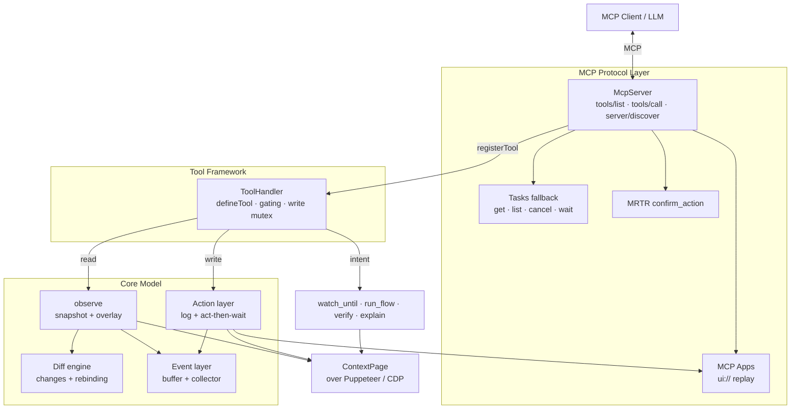
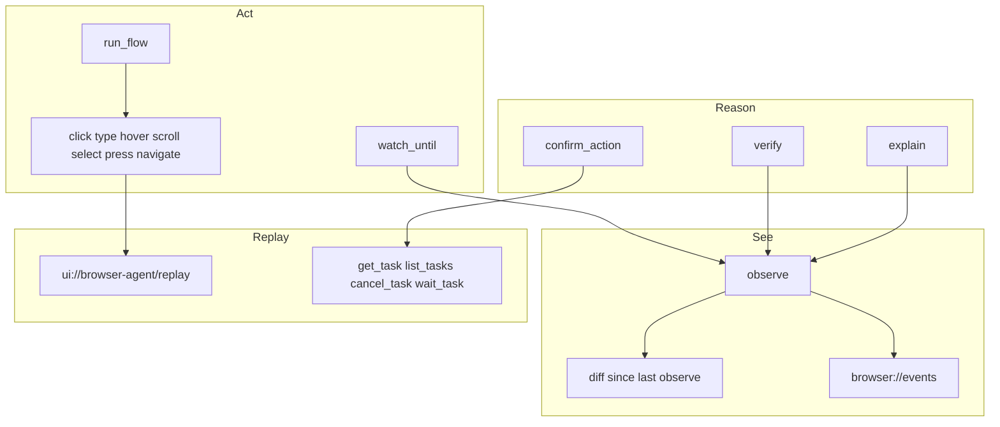

<p align="center">
  
</p>

<p align="center">
  A unified, event-driven, visually-rich <strong>MCP browser-automation server</strong> on Puppeteer, built so the semantic layer and the visual layer are the <em>same object</em>.
</p>

<p align="center">
  <a href="https://github.com/PremierStudio/BrowserAgent/blob/master/LICENSE"></a>
  <a href="https://github.com/PremierStudio/BrowserAgent/actions"></a>
  <a href="https://github.com/PremierStudio/BrowserAgent"></a>
  <a href="https://github.com/PremierStudio/BrowserAgent"></a>
  <a href="https://github.com/PremierStudio/BrowserAgent"></a>
  <a href="https://pptr.dev"></a>
  <a href="https://modelcontextprotocol.io"></a>
  <a href="https://nodejs.org"></a>
  <a href="https://github.com/PremierStudio/BrowserAgent/graphs/contributors"></a>
</p>

<p align="center">
  <a href="#thesis">Thesis</a> · <a href="#why">Why</a> · <a href="#architecture">Architecture</a> · <a href="#getting-started">Getting Started</a> · <a href="#engineering">Engineering</a> · <a href="#roadmap">Product</a>
</p>

---

## ✨ Highlights

- **One model, not two.** `observe` returns the a11y snapshot _and_ the pixel overlay in a single call, so the model never reconciles text and images itself.
- **Diffs, not dumps.** The diff engine returns only what changed since the last observation, with fingerprint-based uid rebinding across navigation.
- **Events, not polling.** Console, network, DOM, and navigation events are collected and pushed, so the model doesn't re-read the page every turn.
- **Strict TDD at 100/100.** Every module lands at 100% coverage _and_ 100% mutation score, enforced by CI.
- **TypeScript-only, zero tolerance.** No `.js`/`.mjs`/`.cjs` anywhere; no `as`, `any`, `!`, or `@ts-ignore` in the codebase.

---

<a id="thesis"></a>

## The thesis

Most browser integrations treat "read the page" and "act on the page" as separate worlds, one returning text and the other returning pixels. That split forces the model to re-read the page every turn and to guess at the relationship between what it _sees_ and what it can _click_.

BrowserAgent's core idea: **build one unified, event-driven, visually-rich model where the semantic layer and the visual layer are the same object**, a model that can both watch and explain.

---

<a id="why"></a>

## Why another browser MCP server?

It's not a fork of `chrome-devtools-mcp`. It borrows that project's _proven patterns_ (stable element uids keyed by `loaderId_backendNodeId`, a `ContextPage` abstraction that hides Puppeteer behind a narrow contract, an "act then wait for stable DOM/navigation" wrapper, and token-optimized formatters) and rebuilds them from scratch around a different product shape.

- **Unified observe, not split snapshot/screenshot.** One call returns the a11y tree _with_ the pixel overlay.
- **Diff, don't re-read.** The diff engine (with fingerprint-based uid rebinding) means the model doesn't pay to re-read the whole page every turn.
- **Events, not polling.** The server pushes changes instead of the model polling.
- **Fewer round trips over micro-optimization.** The browser and the LLM are the bottlenecks, so performance comes from the diff engine and event-driven observation rather than shaving milliseconds.

---

<a id="architecture"></a>

## Architecture



The layers are thin and testable: the protocol layer bridges our tools onto MCP, the `ToolHandler` enforces gating, and the `ContextPage` hides Puppeteer behind a narrow contract so nothing touches the raw page.

The product surface, in dependency order:

| #   | Piece                                                                                                      | Milestone |
| --- | ---------------------------------------------------------------------------------------------------------- | --------- |
| 1   | **`observe`**: a11y snapshot with `uid` + bounding box + zIndex, screenshot, `uid → box` overlay           | **M1**    |
| 2   | **Diff engine**: changes since the last call, not the whole tree                                           | **M2**    |
| 3   | **Event / subscription layer**: console, network, DOM, navigation                                          | **M4**    |
| 4   | **Semantic action log**: `{action, uid, box, timestamp}` (the seed of replay)                              | **M3**    |
| 5   | **Action primitives**: click, type, hover, scroll, select, press, navigate, with the act-then-wait wrapper | **M3**    |
| 6   | **MCP protocol layer**: `tools/list`, `tools/call`, `server/discover`, Tool Annotations on the v2 SDK      | **M5**    |
| 7   | **MCP Apps replay/annotation UI**: scrubbable, animated replay                                             | **M7**    |
| 8   | **Tasks + MRTR**: `watch_until`, `run_flow`, human-in-the-loop gates                                       | **M5-M6** |
| 9   | **Intent tools**: `verify` (pass/fail with evidence), `explain` (annotated visual + summary)               | **M6**    |

---

<a id="getting-started"></a>

## Getting started

### Requirements

| Tool       | Version                                                           |
| ---------- | ----------------------------------------------------------------- |
| Node.js    | `>= 20.19`                                                        |
| npm        | bundled with Node                                                 |
| TypeScript | `^6.0.3` (TS 6, not the 7.x Go port; see `docs/decisions.md` #16) |

### Install

```bash
git clone https://github.com/PremierStudio/BrowserAgent.git
cd BrowserAgent
npm install
```

### Run the server

BrowserAgent speaks MCP over stdio (and Streamable HTTP via `createHttpHandler`).
`npm start` launches a headless Chrome via Puppeteer, attaches the event
collector, and serves the fully-wired MCP server:

```bash
npm start
```

Point any MCP client (Claude Desktop, a custom host, etc.) at the stdio
command `node dist/cli.js`. The server exposes `tools/list`, `tools/call`,
and `server/discover` via the v2 `@modelcontextprotocol/server` SDK.

**Page tools:** `observe`, `click`, `type`, `hover`, `scroll`, `select`, `press`, `navigate`

**Intent tools:** `watch_until`, `run_flow`, `verify`, `explain`

**Tasks fallback** (decision #2, hosts without `ext-tasks`): `get_task`, `list_tasks`, `cancel_task`, `wait_task`

**HITL:** `confirm_action` returns an `InputRequiredResult` (MRTR / elicitation)

**Resources:** `browser://events` (JSON event stream) and `ui://browser-agent/replay` (MCP App HTML replay)

### Run the full gate chain

This is exactly what CI enforces:

```bash
npm run ci
```

### Individual gates

| Command             | What it does                                         |
| ------------------- | ---------------------------------------------------- |
| `npm run typecheck` | `tsc --noEmit`                                       |
| `npm run lint`      | ESLint (bans `as`/`any`/`!`/`@ts-ignore`/`.forEach`) |
| `npm run format`    | Prettier check                                       |
| `npm run knip`      | dead code / unused deps (zero findings)              |
| `npm test`          | Vitest                                               |
| `npm run coverage`  | 100% threshold (lines/branches/functions/statements) |
| `npm run mutation`  | Stryker, 100% threshold + survivor registry          |
| `npm run reports`   | coverage + JUnit XML into `reports/`                 |

### Software stack

| Layer     | Package                                                                                      | Version                    |
| --------- | -------------------------------------------------------------------------------------------- | -------------------------- |
| Protocol  | [`@modelcontextprotocol/server`](https://www.npmjs.com/package/@modelcontextprotocol/server) | `^2.0.0` (2026-07-28 line) |
| Browser   | [`puppeteer`](https://pptr.dev)                                                              | `^25.6.0`                  |
| Schemas   | [`zod`](https://zod.dev)                                                                     | `^4.4.3`                   |
| Language  | [`typescript`](https://www.typescriptlang.org)                                               | `^6.0.3`                   |
| Tests     | [`vitest`](https://vitest.dev)                                                               | `^4.1.10`                  |
| Mutation  | [`@stryker-mutator/core`](https://stryker-mutator.io)                                        | `^9.6.1`                   |
| Lint      | [`eslint`](https://eslint.org)                                                               | `^10.8.1`                  |
| Dead-code | [`knip`](https://knip.dev)                                                                   | `^6.32.2`                  |
| Format    | [`prettier`](https://prettier.io)                                                            | `^3.9.6`                   |

---

<a id="engineering"></a>

## Engineering: strict TDD with a 100/100 gate

Every module is written test-first (RED → GREEN → refactor) and must clear a hard, CI-enforced gate before it is committed:

```text
typecheck → lint → format → knip → unit tests → coverage (100%) → mutation (100%) → survivor registry
```

- **100% coverage** (lines/branches/functions/statements) via Vitest + `@vitest/coverage-v8`.
- **100% mutation score** via Stryker. Coverage alone is a lie; mutation testing proves the tests actually catch real faults. The only escape from the mutation gate is a pre-approved, documented entry in `mutation-survivors.json` (currently empty).
- **No dead code.** knip runs with zero findings. Unused files, exports, and dependencies are removed, not ignored.
- **TypeScript only, everywhere.** No `.js`/`.mjs`/`.cjs` anywhere, including source, configs (`eslint.config.ts`, `stryker.config.ts`, `vitest.config.ts`), and scripts (emitted to `dist-scripts/` via `tsconfig.scripts.json`).
- **No banned constructs.** `as` casts, `any`, `!` non-null assertions, `@ts-ignore`/`@ts-nocheck`/`@ts-expect-error`, and `.forEach` are all lint errors.
- **Deterministic tests.** Clocks and timers are injected, so there are no sleeps and no flaky timing.

The full engineering spec lives in [`docs/mvp.md`](docs/mvp.md); every deviation and protocol decision is recorded in [`docs/decisions.md`](docs/decisions.md).

---

## Repository layout

```text
src/
  actions/       ActionLog (replay seed), ActionRunner, StabilityWaiter (act-then-wait)
  apps/          MCP App replay HTML renderer
  context/       ContextPage abstraction + CDP a11y-tree conversion (axTree)
  diff/          diff engine, fingerprint-based uid rebinding, DiffTracker
  events/        event types, bounded EventBuffer, normalizer, EventCollector
  intent/        watch_until, run_flow, verify, explain
  protocol/      MCP bridge: tools, Tasks fallback, MRTR, HTTP, resources
  session/       BrowserSession composition root (observe+diff+log)
  snapshot/      a11y snapshot builder + uid→box overlay
  tasks/         TaskStore + TaskRunner (owned Tasks state machine)
  tools/         tool framework: defineTool, ToolHandler, ToolMutex, Response, observe
  uid.ts         stable loaderId_backendNodeId uid generation
docs/
  mvp.md         the product plan and non-negotiable engineering requirements
  decisions.md   every amendment (supersedes mvp.md where they conflict)
scripts/         survivor-registry checker (TypeScript, emitted to dist-scripts/)
.github/workflows/ci.yml
```

---

<a id="roadmap"></a>

## Product surface



`observe` is the unified primitive: a11y snapshot, screenshot, overlay, diff, and recent events in one object. Actions go through act-then-wait and seed the replay. Intent tools (`watch_until`, `run_flow`, `verify`, `explain`) sit on top of that model. Long-running work uses the owned Tasks state machine, with a blocking `wait_task` fallback for hosts that do not speak `ext-tasks`. Destructive steps can pause on `confirm_action` via ratified MRTR elicitation.

---

## Contributing

This repo follows the rules in [`AGENTS.md`](AGENTS.md) (binding for every agent) and the spec in [`docs/mvp.md`](docs/mvp.md). The short version:

- **Strict TDD.** Write the failing test first (RED), confirm it fails for the right reason, then implement (GREEN), then refactor.
- **The 100/100 gate.** No module merges unless it's at 100% coverage _and_ 100% mutation score, with typecheck/lint/format/knip clean.
- **No survivor silencing.** A surviving mutant is fixed by strengthening the test, never by weakening the code or adding ignore comments.
- **TypeScript only.** No `.js`/`.mjs`/`.cjs`, including configs and scripts.

---

## License

Apache License 2.0 © [Premier Studio](https://github.com/PremierStudio). See [LICENSE](LICENSE).
